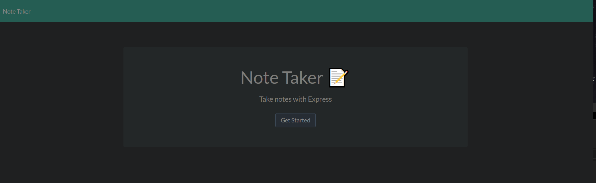
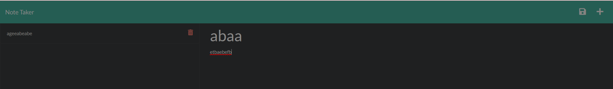

# Note-butler

## Description

this is a website application that lets you make and maintain notes for personal use it was made to make managing tasks and otherwise more easily managable
it lets you save notes and tasks and lets you sort them and clear them as you go 

## Use
when you start the app you will see a home page that looks like this

press the get started button to get to the main notes page which looks like

there is a left hand side that hold the stored notes there is a trash can that is there to let you delete old notes and review old notes on large
there is a larger right hand side that has a title box text box and two icons on the top left. the title box is the part that shows up on the list
on the left hand side and the text box only shows up when reviewing the note, both must be filled to save it and add it to the list on the left.
there are the two icons at the top left the save and the new note icon the ne note icon clears the notepad so you can make a new note and the save
icon saves the currently typed note and puts it in the left hand side to review later and it is saved until you delete it or the heat death of the
universe whicheer comes first
